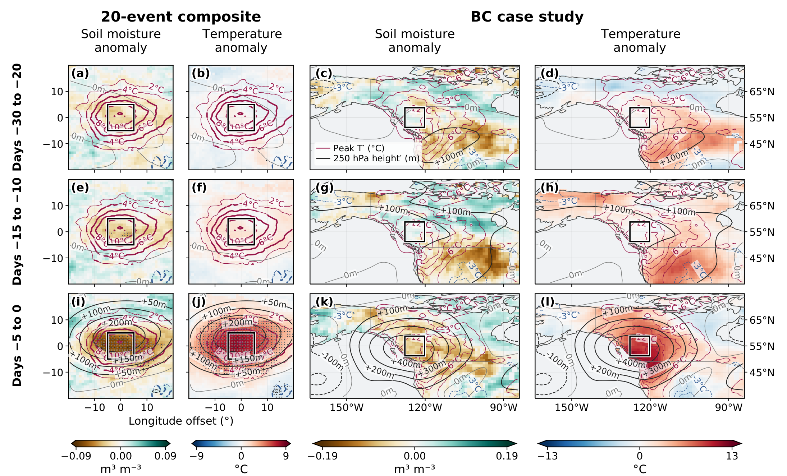

# Heatwave

## Soil moisture and temperature before heatwaves

**Figure 1. Soil-moisture and temperature anomalies leading up to heatwaves.** The left two columns show a heatwave-centered composite of 20 events; the right two columns show the British Columbia (BC) case study of the 2021 heatwave. From top to bottom, rows show days -30 to -20, -15 to -10, and -5 to 0 relative to the peak temperature day. Colored contours show temperature anomalies at the peak of each heatwave; black contours show 250 hPa height anomalies. Shading scales differ between the composite and case-study panels.

[View or download Figure 1 (PDF)](figures/Figure1.pdf)
