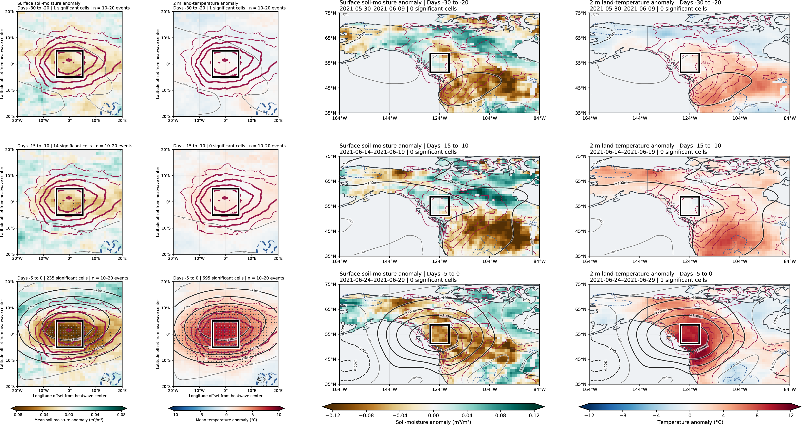

# Heatwave

## Soil moisture and temperature before heatwaves

**Figure 1. Soil-moisture and temperature anomalies leading up to heatwaves.** The left two columns show heatwave-centered composites of surface soil-moisture and 2 m land-temperature anomalies (10–20 events); the right two columns show the corresponding fields for the 2021 western North American heatwave. From top to bottom, rows show days −30 to −20, −15 to −10, and −5 to 0 relative to the reference day. Brown and green shading indicate negative and positive soil-moisture anomalies (m³/m³), respectively; blue and red shading indicate negative and positive temperature anomalies (°C).

[View or download the full-resolution figure](figures/Figure_drought.png)
